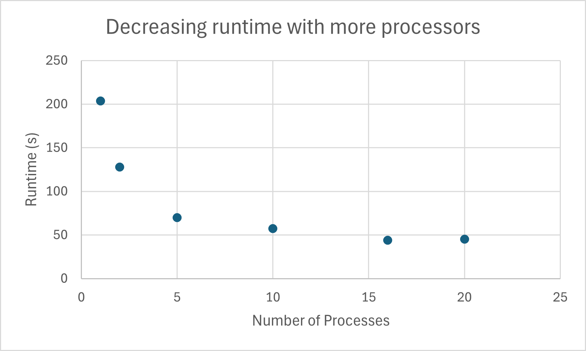

# System Programming Lab 11 Multiprocessing

My impementation leaves the given files mostly untouched, just converts it to a function that can be called with the regular arguments. There is a semaphore that starts at a value of the number of child processes that this instance of the program uses, decided by the command line argument "-n". The parent process uses sem_wait before forking, each child process generates one image and then does sem_post and exits. This makes it so the parent only forks when less than the total child processes decided by the user are running. The result is the directory named "images" gets filled with 50 image files.

These results show that increasing the processes used will improve the runtime of your program, with diminishing returns. This is mostly because the computer only has a limited number of processors (16 for the laptop used), and you can see how it clearly levels out after 16.

<h3>Multithreading</h3>

I split the image vertically to be processed in slices. 4 threads = 4 slices. It passes in a large structure with all the parameters for the "interations_at_point" function

        1	    2	    4  	    8	    16	    threads
    1	218.467	169.777	110.874	79.157	59.799	
    2	140.337	102.535	73.241	56.425	51.064	
    4	78.866	70.848	54.336	47.314	47.242	
    8	61.481	53.058	48.903	47.085	47.283	
    16	47.903	44.906	44.504	44.156	44.071	
    processes		

It seems that splitting into multiple processes has more impact. I think this is because the way the multithreading is set up is not at efficient as possible, and the way the processes are split up splits the work more evenly. It seems like making both the processes and threads high allows the system to efficiently split the work the best out of all, but 8 processes and 4 threads was pretty close to that.

